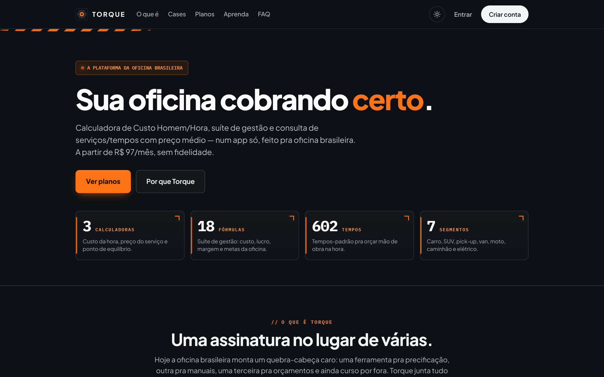
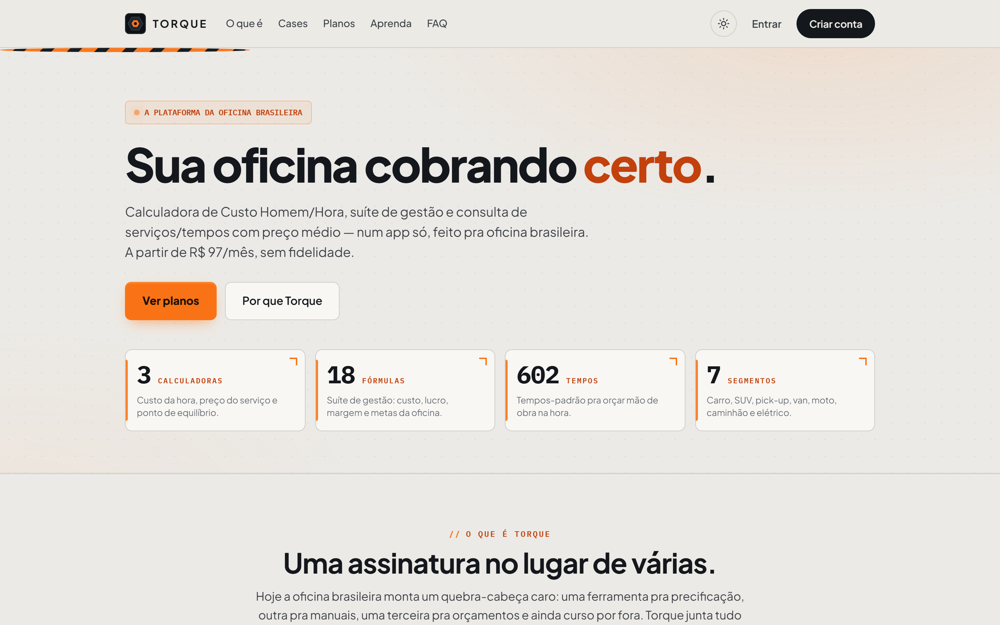
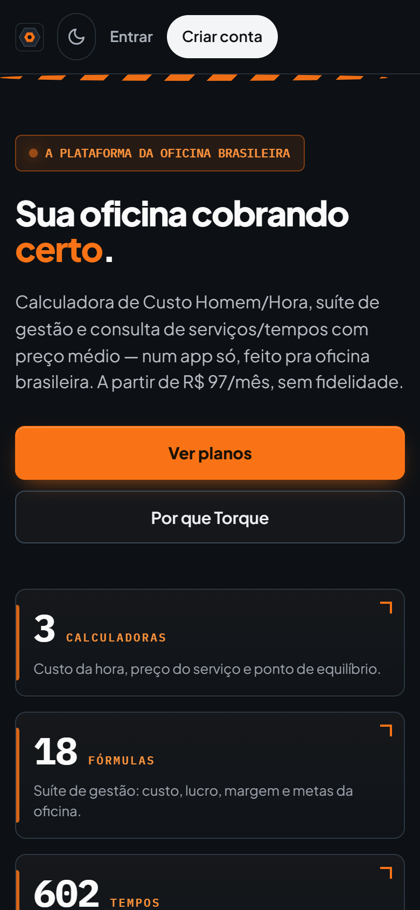

# Torque

**A plataforma all-in-one da oficina mecânica.**
*Do orçamento à entrega do carro — a gestão inteira da sua oficina num app só.*

---

Sua oficina roda no caderno, no WhatsApp e em cinco planilhas soltas. O orçamento você faz "no olho", o cliente some, a peça acaba sem ninguém ver e no fim do mês ninguém sabe se sobrou dinheiro. **Torque junta tudo isso num sistema só** — feito pra oficina brasileira, pra usar no computador da recepção **ou no celular, no meio do box**.

Uma assinatura no lugar da papelada: cadastro de cliente, ordem de serviço, orçamento, estoque e financeiro conversando entre si. Você abre a OS, adiciona as peças, o sistema calcula o preço com o **custo real da sua hora de trabalho**, manda o orçamento pro cliente e — quando o carro sai — o financeiro já registrou. Sem retrabalho, sem achismo.

## 💪 Por que o dono de oficina assina

- **Chega de caderno.** Cliente, veículo, histórico de serviço e financeiro num lugar só — e nas suas mãos onde você estiver.
- **Do orçamento à entrega, sem furo.** Cada carro vira uma ordem de serviço que anda por etapas: orçamento → aprovação → execução → entrega. Nada trava porque "esqueceram de avisar".
- **Você para de trabalhar no prejuízo.** O Torque calcula o **Custo Homem/Hora real** da sua oficina — aluguel, energia, salário, ferramenta — e mostra por quanto você *precisa* cobrar pra ter lucro. Fim do preço "no chute".
- **Controle total.** Quanto entrou, quanto saiu, o que está no estoque, quem deve, qual carro está no pátio — num painel só, atualizado na hora.
- **Cliente volta.** Histórico por placa: você sabe tudo que já fez naquele carro e lembra o cliente da próxima revisão.
- **Sem fidelidade.** Cancela quando quiser, direto pela plataforma. A ferramenta tem que provar que vale — não te prender.

## 🔧 O que tem dentro

- **Ordens de serviço** — do orçamento à entrega, com etapas, peças, mão de obra e status do carro.
- **Clientes & veículos** — cadastro completo, busca por placa e histórico de tudo que já passou na oficina.
- **Estoque** — controle de peças e insumos, entrada e saída amarradas na OS.
- **Orçamento profissional** — monta, envia pro cliente e transforma em serviço aprovado com um clique.
- **Financeiro** — entradas, saídas, contas e a saúde real do caixa num painel só.
- **Precificação inteligente** — suíte de calculadoras (Custo Homem/Hora, custo fixo/variável, meta de lucro) pra você cobrar certo.
- **Consulta de serviços** — 600+ serviços com tempo-padrão e preço médio de referência, por categoria e por veículo.
- **Placa / FIPE + Recall** — identifica o veículo e puxa recall (plano Oficina Pro).
- **Funciona no celular** — PWA instalável no Android/iOS, roda offline e recebe notificação. Sem baixar da loja.

## 💰 Planos

Duas opções, **sem fidelidade**, com **preço de lançamento**. Cancela quando quiser, pela própria plataforma.

| | **Gestão Essencial** | **Oficina Pro** |
|---|---|---|
| Preço | **R$ 97/mês** ~~R$ 147~~ | **R$ 227/mês** ~~R$ 297~~ |
| Ordens de serviço | ✅ | ✅ |
| Clientes & veículos | ✅ | ✅ |
| Estoque | ✅ | ✅ |
| Orçamentos | ✅ | ✅ |
| Financeiro | ✅ | ✅ |
| Suíte de precificação | ✅ | ✅ |
| Consulta de serviços (600+) | ✅ | ✅ |
| Placa / FIPE + Recall | — | ✅ |
| Recursos avançados de gestão | — | ✅ |

➡️ **Assine em [torqueoficina.com.br](https://torqueoficina.com.br)** — cria a conta, testa a plataforma e ativa o plano com pagamento recorrente (Mercado Pago). Preço de lançamento por tempo limitado.

## 🖼 Telas

| Painel (escuro) | Painel (claro) | No celular |
|---|---|---|
|  |  |  |

> Identidade **industrial**: hexágono de aço + soquete laranja, faixa hazard, spec cards e tipografia técnica (Space Grotesk + JetBrains Mono). Tema claro e escuro, contraste WCAG AA nos dois.

## 🧱 Como é feito

- **Plataforma Web / PWA** — instalável no Android e iOS, roda offline (service worker) e recebe push.
- **Firebase** — Hosting, Firestore, Auth, Cloud Functions e FCM (região `southamerica-east1`, dados no Brasil).
- **Mercado Pago** — assinatura recorrente, cancelável pela plataforma.
- **Mobile-first** — pensado pra ser usado no celular, no meio da oficina.

## 🔐 Privacidade & Licença

- **Privacy by Design / LGPD** — analytics só com **consentimento explícito** (opt-in). Páginas de [Privacidade](https://torqueoficina.com.br/privacidade), [Termos](https://torqueoficina.com.br/termos) e [LGPD](https://torqueoficina.com.br/lgpd).
- **Foco no Brasil** — interface e conteúdo 100% em pt-BR, para oficinas brasileiras.
- **Licença proprietária** — este é um repositório de **apresentação pública**. O código-fonte é fechado. Nada de dado ou segredo aqui.

## 👤 Sobre o desenvolvedor

**Paulo Adriel** é produtor de vídeo e desenvolvedor indie brasileiro. Construo o produto **e** a apresentação dele — código + identidade visual, motion e material de lançamento — do zero ao ar em 30 dias. Trabalho de forma aberta e escuto quem usa. Estúdio [**Paulocodex**](https://paulocodex.com).

 

---

📧 [paulobatista19988@proton.me](mailto:paulobatista19988@proton.me) &nbsp;·&nbsp; 🌐 [paulocodex.com](https://paulocodex.com) &nbsp;·&nbsp; 📸 [Instagram](https://instagram.com/paulo.videodev) &nbsp;·&nbsp; 💼 [LinkedIn](https://www.linkedin.com/in/paulo-adriel/) &nbsp;·&nbsp; 🐙 [github.com/Paulothedeveloper](https://github.com/Paulothedeveloper)

_Repositório de **apresentação pública** — o código-fonte é fechado. Nada de dado ou segredo aqui._

