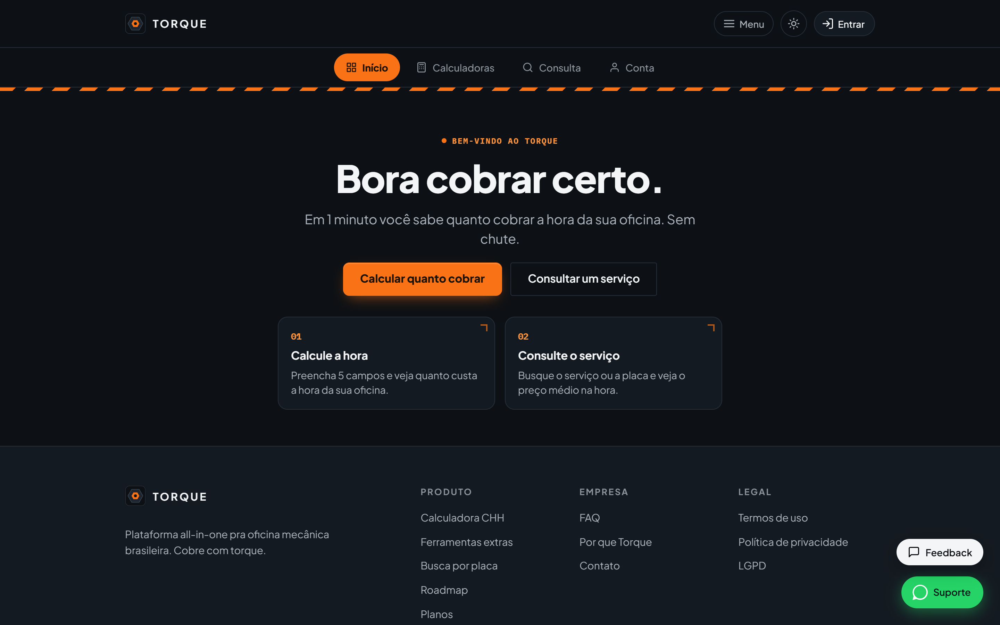
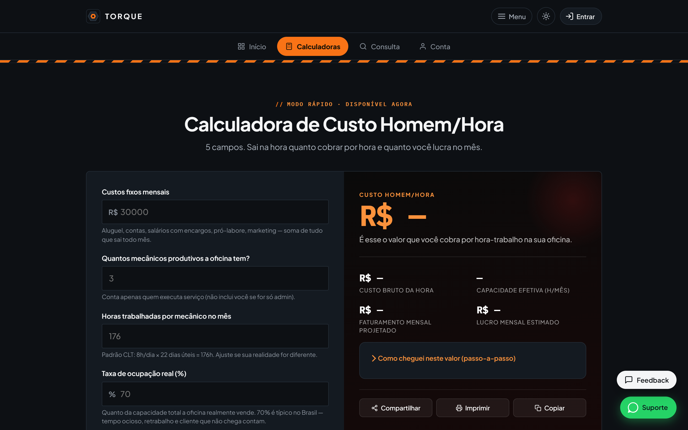

# Torque

**A plataforma da oficina mecânica brasileira.**
*Calculadora de Custo Homem/Hora, suíte de gestão e consulta de serviços com preço médio, num app só.*

---

Sua oficina cobra "no olho", perde tempo procurando preço de serviço e no fim do mês ninguém sabe se sobrou dinheiro. **O Torque resolve o núcleo disso num app só:** feito pra oficina brasileira, pra usar no computador da recepção **ou no celular, no meio do box**.

Ele calcula o **custo real da sua hora de trabalho** (o tal do Custo Homem/Hora), roda a suíte inteira de contas da oficina, e ainda te dá uma **consulta de 600+ serviços com tempo-padrão e preço médio:** mais identificação por **placa/FIPE** e **Recall por chassi**. Uma assinatura no lugar de três ferramentas soltas. A partir de **R$ 97/mês, sem fidelidade**.

## Por que o dono de oficina assina

- **Você para de trabalhar no prejuízo.** O Torque calcula o **Custo Homem/Hora real** da sua oficina (aluguel, energia, salário, ferramenta) e mostra por quanto você *precisa* cobrar pra ter lucro. Fim do preço "no chute".
- **A suíte inteira de contas.** Custo fixo, custo variável, hora-box, precificação, meta de faturamento, lucro e lucro real: todas as calculadoras da oficina num lugar só.
- **Preço de serviço na hora.** Consulta de **600+ serviços** com tempo-padrão e preço médio de referência, por categoria e por veículo. Chega de abrir cinco sites.
- **Identifica o carro na placa.** Busca por **placa/FIPE** e, no Oficina Pro, **Recall por chassi:** você sabe o que aquele veículo tem pendente antes de encostar a mão.
- **No bolso, no box.** PWA instalável no Android/iOS, roda offline e recebe notificação, sem baixar da loja. Feito **mobile-first**, pra usar no meio da oficina.
- **Sem fidelidade.** Cancela quando quiser, direto pela plataforma. A ferramenta tem que provar que vale, não te prender.

## O que está no ar

- **Suíte de calculadoras de gestão:** Custo Homem/Hora, custo fixo/variável, hora-box, precificação, meta de faturamento, lucro e lucro real.
- **Consulta de serviços:** 600+ serviços com tempo-padrão e preço médio de referência, por categoria e por veículo.
- **Placa / FIPE:** identifica o veículo (10/dia no Essencial, 30/dia no Oficina Pro).
- **Recall por chassi:** pendências de recall do veículo (Oficina Pro, 30/dia).
- **PWA mobile:** instalável, roda offline, notificação. Tema claro e escuro, contraste WCAG AA nos dois.

## No mapa (chegando)

Ordens de serviço, cadastro de clientes, estoque, orçamentos e financeiro estão em construção e entram **por atualização, sem custo extra** pra quem já é assinante. O núcleo (precificação e consulta) já está no ar hoje.

## Planos

Duas opções, **sem fidelidade**, com **preço de lançamento** nos 3 primeiros meses. Cancela quando quiser, pela própria plataforma.

| | **Gestão Essencial** | **Oficina Pro** |
|---|---|---|
| Preço (lançamento) | **R$ 97/mês** ~~R$ 147~~ | **R$ 227/mês** ~~R$ 297~~ |
| Suíte completa de calculadoras | ✅ | ✅ |
| Custo Homem/Hora · precificação · lucro | ✅ | ✅ |
| Consulta de 600+ serviços e tempos | ✅ | ✅ |
| Identificação por placa / FIPE | ✅ 10/dia | ✅ 30/dia |
| Recall por chassi | — | ✅ 30/dia |

**Assine em [torqueoficina.com.br](https://torqueoficina.com.br):** cria a conta, testa a plataforma e ativa o plano com pagamento recorrente (Mercado Pago). Preço de lançamento por tempo limitado.

## Telas

**No app (logado):**

| Início: comece por aqui | Calculadora de Custo Homem/Hora |
|---|---|
|  |  |

**Landing (pública):**

| Desktop escuro | Desktop claro | No celular |
|---|---|---|
|  |  |  |

> Identidade **industrial**: hexágono de aço + soquete laranja, faixa hazard, spec cards e tipografia técnica. Tema claro e escuro, contraste WCAG AA nos dois.

## Como é feito

- **Plataforma Web / PWA:** instalável no Android e iOS, roda offline (service worker) e recebe push.
- **Firebase:** Hosting, Firestore, Auth, Cloud Functions e FCM (região `southamerica-east1`, dados no Brasil).
- **Mercado Pago:** assinatura recorrente, cancelável pela plataforma.
- **Mobile-first:** pensado pra ser usado no celular, no meio da oficina.

## Privacidade & Licença

- **Privacy by Design / LGPD:** analytics só com **consentimento explícito** (opt-in). Páginas de [Privacidade](https://torqueoficina.com.br/privacidade), [Termos](https://torqueoficina.com.br/termos) e [LGPD](https://torqueoficina.com.br/lgpd).
- **Foco no Brasil:** interface e conteúdo 100% em pt-BR, para oficinas brasileiras.
- **Licença proprietária:** este é um repositório de **apresentação pública**. O código-fonte é fechado. Nada de dado ou segredo aqui.

## 🥷 Mascote

Todo projeto do estúdio tem o **ninja Codex** na cor da sua identidade: o mesmo mascote da casa, recolorido pro tema do **Torque**.

 

## Sobre o desenvolvedor

**Paulo Adriel** é produtor de vídeo e desenvolvedor indie brasileiro. Construo o produto **e** a apresentação dele (código + identidade visual, motion e material de lançamento) do zero ao ar em 30 dias. Trabalho de forma aberta e escuto quem usa. Estúdio [**Paulocodex**](https://paulocodex.com).

 

---

📧 [contato@paulocodex.com](mailto:contato@paulocodex.com) &nbsp;·&nbsp; 🌐 [paulocodex.com](https://paulocodex.com) &nbsp;·&nbsp; 📸 [Instagram](https://instagram.com/paulodev.codex) &nbsp;·&nbsp; 💼 [LinkedIn](https://www.linkedin.com/in/paulo-adriel/) &nbsp;·&nbsp; 🐙 [github.com/Paulothedeveloper](https://github.com/Paulothedeveloper)

_Repositório de **apresentação pública**: o código-fonte é fechado. Nada de dado ou segredo aqui._

